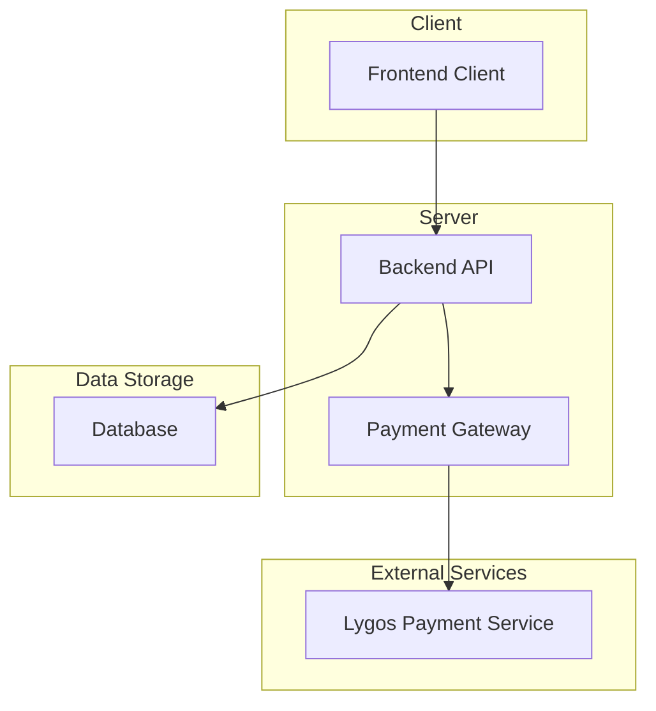
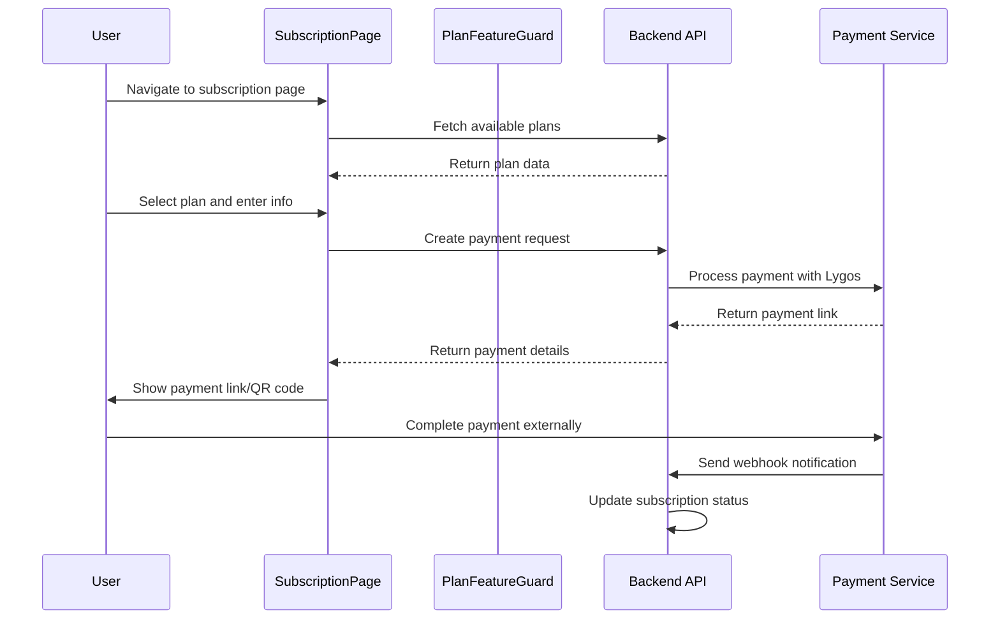
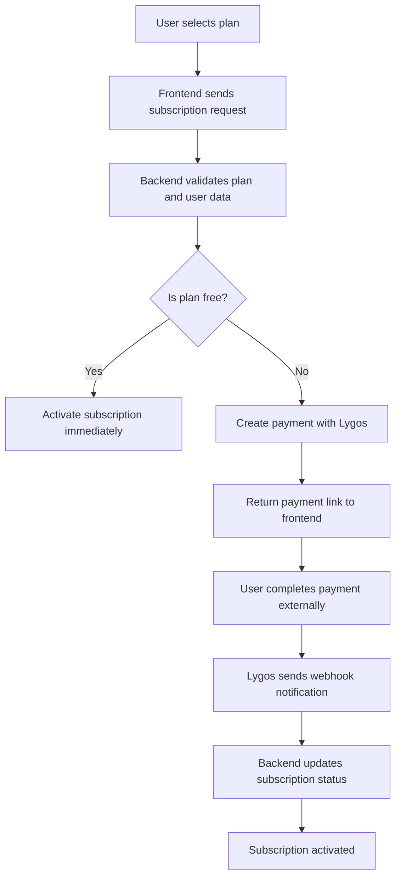
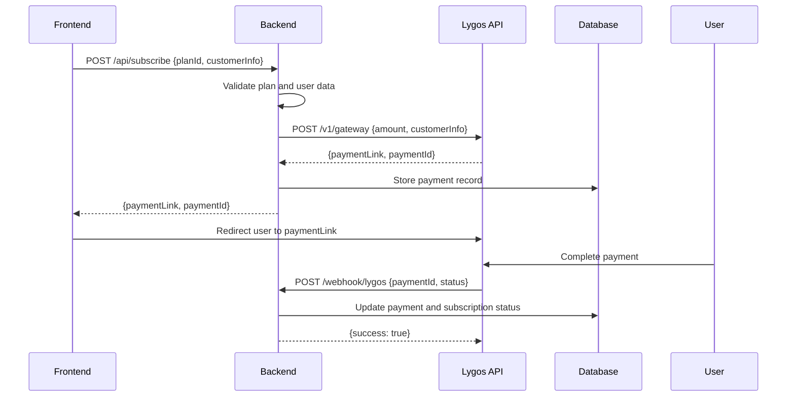

# Plan Subscription System Design

## Overview

This document describes the design of the plan subscription system for the streaming platform. The system allows users to subscribe to different plans (Basic, Standard, Premium, VIP) with varying features and pricing. The implementation involves both frontend and backend components working together to provide a seamless subscription experience.

## Architecture

The subscription system follows a client-server architecture with the following components:

### Key Components

1. **Frontend Subscription Page**: User interface for selecting and purchasing plans
2. **Backend Subscription Routes**: API endpoints for managing subscriptions
3. **Payment Service**: Integration with Lygos payment gateway
4. **Database Storage**: Persistent storage for subscription data
5. **Authentication System**: User authentication and authorization

## Subscription Plans

The system supports multiple subscription plans with different features:

| Plan ID | Name     | Price (FCFA) | Duration (days) | Max Devices | Video Quality | Download | Exclusive Content | Support Level |
|---------|----------|--------------|-----------------|-------------|---------------|----------|-------------------|---------------|
| free    | Gratuit  | 0            | 30              | 1           | SD            | No       | No                | Basic         |
| basic   | Basic    | 2000         | 30              | 1           | SD            | No       | No                | Basic         |
| standard| Standard | 3000         | 30              | 2           | HD            | Yes      | No                | Priority      |
| premium | Premium  | 4000         | 30              | 4           | 4K            | Yes      | Yes               | Priority      |
| vip     | VIP      | 5000         | 30              | Unlimited   | 4K            | Yes      | Yes               | VIP           |

## Frontend Architecture

### Component Structure

The subscription system in the frontend consists of several key components:

1. **SubscriptionPage**: Main page for managing subscriptions
2. **PlanFeatureGuard**: Component to restrict access based on plan features
3. **PlanFeatureComparison**: Visual comparison of plan features
4. **usePlanFeatures**: Custom hook for accessing plan information

### Data Flow

### Plan Feature Management

The frontend uses a feature-based approach to control access to different functionalities:

| Feature         | Description                          | Plan Requirements          |
|-----------------|--------------------------------------|----------------------------|
| download        | Ability to download content          | Standard, Premium, VIP     |
| hd              | HD video quality access              | Standard, Premium, VIP     |
| 4k              | 4K video quality access              | Premium, VIP               |
| exclusive       | Access to exclusive content          | Premium, VIP               |
| prioritySupport | Priority customer support            | Standard, Premium, VIP     |
| earlyAccess     | Early access to new content          | VIP                        |
| noAds           | Ad-free viewing experience           | Basic, Standard, Premium, VIP |
| multipleDevices | Multiple simultaneous device access  | Standard, Premium, VIP     |

## Backend Architecture

### API Endpoints

The backend provides several endpoints for subscription management:

| Endpoint                      | Method | Description                           |
|-------------------------------|--------|---------------------------------------|
| /api/subscription/plans       | GET    | Retrieve available subscription plans |
| /api/subscription/current     | GET    | Get current user's subscription       |
| /api/subscription/payment-history | GET | Get user's payment history            |
| /api/subscribe                | POST   | Create a new subscription/payment     |
| /api/subscription/check-payment/:id | GET | Check payment status              |

### Payment Processing Flow

### Database Schema

The subscription system uses the following database tables:

#### Subscriptions Table

| Column         | Type      | Description                            |
|----------------|-----------|----------------------------------------|
| id             | UUID      | Unique subscription identifier         |
| user_id        | UUID      | Reference to user                      |
| plan_id        | TEXT      | Plan identifier (free, basic, etc.)    |
| amount         | INTEGER   | Subscription amount in FCFA            |
| payment_method | TEXT      | Payment method used                    |
| status         | TEXT      | Subscription status (active, etc.)     |
| start_date     | TIMESTAMP | Subscription start date                |
| end_date       | TIMESTAMP | Subscription end date                  |
| created_at     | TIMESTAMP | Record creation timestamp              |

#### Payments Table

| Column         | Type      | Description                            |
|----------------|-----------|----------------------------------------|
| id             | UUID      | Unique payment identifier              |
| user_id        | UUID      | Reference to user                      |
| subscription_id| UUID      | Reference to subscription              |
| amount         | INTEGER   | Payment amount in FCFA                 |
| method         | TEXT      | Payment method used                    |
| status         | TEXT      | Payment status (pending, success, etc.)|
| transaction_id | TEXT      | External transaction identifier        |
| payment_data   | JSONB     | Additional payment gateway data        |
| created_at     | TIMESTAMP | Record creation timestamp              |

## Payment Integration

### Lygos Payment Service

The system integrates with the Lygos payment gateway for processing payments:

1. **Payment Creation**: When a user selects a paid plan, the system creates a payment request with Lygos
2. **Payment Link**: Lygos returns a payment link that the user can follow to complete payment
3. **Webhook Notification**: Lygos sends a webhook notification when payment status changes
4. **Status Update**: The backend updates the subscription based on payment status

### Payment Flow Sequence

## Security Considerations

1. **Authentication**: All subscription endpoints require user authentication
2. **Authorization**: Only authenticated users can create subscriptions
3. **CSRF Protection**: CSRF tokens are used for payment endpoints
4. **Data Validation**: All input data is validated on both client and server
5. **Payment Verification**: Payment status is verified through webhooks, not just client notifications

## Error Handling

The system handles various error scenarios:

1. **Invalid Plan Selection**: User selects a non-existent plan
2. **Payment Processing Errors**: Issues with the payment gateway
3. **Network Failures**: Connection issues during payment processing
4. **Subscription Conflicts**: Attempting to create multiple subscriptions
5. **Database Errors**: Issues with storing subscription data

## Testing Strategy

### Unit Tests

1. **Plan Validation**: Test that only valid plans can be selected
2. **Payment Creation**: Test payment creation with different plan types
3. **Subscription Activation**: Test that subscriptions are properly activated
4. **Feature Access**: Test that users can only access features in their plan

### Integration Tests

1. **End-to-End Payment Flow**: Test the complete payment process from plan selection to subscription activation
2. **Webhook Processing**: Test that webhook notifications properly update subscription status
3. **Database Operations**: Test that subscription data is correctly stored and retrieved

## Future Enhancements

1. **Plan Upgrades/Downgrades**: Allow users to change their subscription plan
2. **Proration**: Handle partial billing periods when changing plans
3. **Coupon System**: Add support for discount codes
4. **Subscription Renewal**: Automatic renewal of subscriptions
5. **Refund Management**: Process refunds for subscriptions